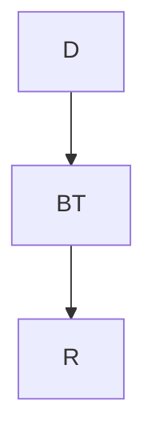

# Tasks of Cristian José Zayas Arieta  👨🏻‍💻


## Introduction to programming & Javascript - Week 1


## Week goal 🏁
Learn about the basics of programming and start knowing Javascript
## Week subtopics 🥰
| Preguntas    🧐       | Respuestas  🤭                                                             |
| ----------------- | ------------------------------------------------------------------ |
| What does programming look like? | Programar es una actividad que nos hace sentir vivos, y demuestra que somos seres inteligentes. Programar, no es una actividad mecánica. |
| What really is programming? | La programación es el proceso de crear un conjunto de instrucciones que le  dicen a una computadora como realizar algún tipo de tarea. |
| What is a program? | Un programa informático o programa de computadora es una secuencia de instrucciones, escritas para realizar una tarea específica en un computador.​  |
| How a computer run a program? |  Instrucción por instrucción hasta que termina. |
| Algorithmic operations | Los operadores son símbolos que representan una acción a realizar con los números o elementos que se encuentran antes o después. |
| Sequential | También conocido como estructura secuencial, es aquella en la que una instrucción o acción sigue a otra en secuencia|
| Conditional | Un condicional, como su nombre lo indica, es una condición para discernir entre una opción u otra, y en el proceso mental normalmente se manifiesta con un “Si”; por ejemplo: Si (va a llover), coge el paraguas. |
| Iterative |  Las operaciones o instrucciones son las mismas pero los datos que se procesan pueden cambiar en la ejecución del ciclo. |
| Basic elements of programming | Lenguaje común, Diagramas de flujo, Pseudocódigo, Lenguajes de programación |
| Instruction set | Un programa no es más que un conjunto de sentencias que se ejecutan para realizar una cierta tarea. |
| Variables | En programación, una variable está formada por un espacio en el sistema de almacenaje (memoria principal de un ordenador) y un nombre simbólico (un identificador) que está asociado a dicho espacio. |
| Output | En informática el output corresponde a los datos que proporciona un computador después de procesar la información que ha recibido.|
| Wat is javascript? | JavaScript es un lenguaje de programación interpretado, dialecto del estándar ECMAScript. |
| What is an interpreted language? |Se define como orientado a objetos, ​ basado en prototipos, imperativo, débilmente tipado y dinámico. |
| HTMl basics | El Lenguaje de Marcado de Hipertexto (HTML) es el código que se utiliza para estructurar y desplegar una página web y sus contenidos. |
| Javascript Hello World | Console.log('Hello World...') |
| Variables in Javascript | Var, Const, let> |
| Basic HTML structure | La estructura básica de una página web se compone por las etiquetas <html>, <head> y <body>. |


## Week challenges (Tuesday) 💻

For support, email fake@fake.com or join our Slack channel.

# Pseudocode currency converter

# Description

You have been selected to develop the algorithm that will be used to convert dollars (USD) to bitcoin (BTC), for this the first thing you must do is deliver a pseudocode with the algorithm to be developed, in this way you can explain in a better way to the team what will be the required operation. The main idea is to have a website where the user will be asked to enter the amount to convert.

```
Algoritmo BTC
	Escribir  "ingrese la cantidad en dolares a convertir bitcoin"
	Leer USB
	USB <-  USB * 0.0000440
	Escribir USB
FinAlgoritmo
```

Here is a simple flow chart:



## Week challenges (Wednesday) 💻

Your date of birth in the matrix?
Description
Your team has just seen the movie "Matrix" and you have been asked, how the number of your year of birth would be written in binary. You must learn how to translate your date of birth into binary and show your team. (Do not use a webpage or a tool to convert your date of birth)


| Fecha de nacimiento | Binario|
|----------|------------------|
|  1997 | 11111001101 |


## MIPS


```
  .data
	      result_message: .asciiz "\nEl resultado es: "
  .text
	      main:
              li $t0, 20
              li $t1, 10

              add $t2, $t0, $t1

              li $v0, 4
              la $a0 result_message
              syscall

              li $v0, 1
              move $a0, $t2
              syscall
              
              li $t0, 30
              li $t1, 20
              
              li $t0, 20
              add $t2, $t0, $t1
```

## Week challenges (Thursday) 💻

# Print special numbers

### Description

In this exercise you must use an iterative flow control to be able to print all the even numbers in the range of numbers from 0 to 100. Remember that you should not print each number, you should use a flow control structure to perform the exercise

```
for (let i = 0; i < 100; i++) {
  console.log(i)
}
```

## Bad code
### Description
The code shown below is not working in the right way, as a task you must find the error made by the developer who programmed this code and correct it, for this exercise you must explain what the error is and place the correct code

```
var cond = false;

if ((cond === true)) {
  console.log('The cond variable is true');
} else {
  console.log('The cond variable is false');
}
```

## Bad code 2
# Description

You must create the code that follows the following logic, if the given number is 100, take this number as special and show the following message: "This is a special number!", but if the number is less than 1000, multiple of 10 and different from 100, you must show the following message: "This number is almost special". if none of the given conditions are met show the following message: "Just a regular number". Another developer was trying to program the logic, but apparently couldn't, you need to fix the code to work properly

```
const  n = 100;

if (n == 100) {
  console.log("¡Este es un número especial!");
} else if (n < 1000 || n % 10 == 0) {
 console.log('Este número es casi especial');
} else {
  console.log('Sólo un número normal');
}
```

# Javascript - Week 2 🗓
# Excersices CodeWars
## Multiply
```
function multiply(a, b){
return   a * b
}
```
## ASCII Total exercise
```
function uniTotal (string) {
 let total = 0;
  for (let i of string ){
    total += i.charCodeAt()
  }
  return total
}
```
# Char From ASCII Value exercise

```
function getChar(c){
   return String.fromCharCode(c)
}
```
# Binary Addition exercis

```
function addBinary(a,b) {
  return (a + b).toString(2)
}
```

# Binary Addition exercise

```
function finalGrade (exam, projects) {
  if(exam > 90 || projects > 10) return 100
  if(exam > 75 && projects >= 5) return 90
  if (exam > 50 && projects >= 2) return 75
   return 0
}
```

# Thursday 28 of July of 2022

## Remove All Exclamation Marks From The End Of Sentence

```
function remove (string) {  
  return string.replace(/!+$/,'');
}
```
## Vowel Remover

```
function shortcut (string) {
  return string.replace(/[aeiou]/g,'');
}
```
# Rock Paper Scissors!
```
const rps = (p1, p2) => {
  const rules = { rock: 'scissors', paper: 'rock', scissors: 'paper' }
  if( p1 === p2 ) return "Draw!"
  if( p2 === rules[p1]) {
    return 'Player 1 won!';
  }else {
    return 'Player 2 won!';
  } 
};
```

# Persistent Bugger exercise

```
function persistence(num) {
   let countOneNumber = 0;
  num = num.toString()
    while(num.length > 1){
      countOneNumber++
     num =  num
       .split('')
         .map((z) => Number(z))
         .reduce((a,b) => a * b )
         .toString()
    }
    return countOneNumber 
  
}
```

# Holiday VIII - Duty Free

```
return Math.floor(hol / ((discount * normPrice) / 100));
```

# Twice As Old 
```
return Math.abs(dadYearsOld - 2 * sonYearsOld)
```
# Valid Spacing

```
{if(s.charAt(0) === ' ' || s.charAt(s.length - 1) === ' ') { 
     return false;
  }
  
  for(let i = 0; i < s.length; i++) {
    if(s.charAt(i) === ' '){ 
      if(i != 0 && s.charAt(i-1) === ' ') {
        return false;
      }
      if(i != (s.length - 1) && s.charAt(i+1) === ' ') {
        return false;
      }
    }
  }
  return true;
} 
  ```

# Fake Binary

```
	function fakeBin(x){
let verifyDigits = '';
  for (let i = 0; i < x.length; i++) {
    if (parseInt(x[i]) < 5) {
      verifyDigits = verifyDigits + '0';
    } else {
      verifyDigits = verifyDigits + '1';
    }
  }
  return verifyDigits;
}
```

## Javascript - Week 3 🗓
# Who Likes It?
```
function likes(names) {
    names = names || [];
  switch(names.length){
    case 0: return 'no one likes this'; break;
    case 1: return names[0] + ' likes this'; break;
    case 2: return names[0] + ' and ' + names[1] + ' like this'; break;
    case 3: return names[0] + ', ' + names[1] + ' and ' + names[2] + ' like this'; break;
    default: return names[0] + ', ' + names[1] + ' and ' + (names.length - 2) + ' others like this';
  }
}
```
# Bit Counting

```
	var countBits = function(n) {
 return n.toString(2)
  .split('')
  .reduce((total, val) => total + Number(val), 0)
};
```
# Your order, please

```
	function order(words){
  let wordsArray = words.split(' ');
  wordsArray = wordsArray.sort(
    (w1, w2) => Number(w1.replace(/\D/g, '')) - Number(w2.replace(/\D/g, ''))
  );
  return wordsArray.join(' ');
}
	```

# Simple Pig Latin

```function pigIt(str){
  let newStrr = ['!', '¡', '?', '¿', '.', ',', ':', ';'];
  let array = str.split(" ");
  for (let i = 0; i < array.length; i++){
    if(newStrr.indexOf(array[i]) >= 0) continue;
    array[i] =   array[i].slice(1) + array[i].slice(0,1) + "ay"; 
  } 
  return array.join(' ')
}```

# Counting Duplicates

```function duplicateCount(text){
  return (text.toLowerCase().split('').sort().join('').match(/([^])\1+/g) || []).length;
}```

# Decode The Morse Code

```decodeMorse = function(morseCode){
  morseCode = morseCode.replace(/   /g, '#');
  let decodedCode = '';
  let tempWordToDecode = '';
  for (let i = 0, lenght = morseCode.length; i < lenght; i++) {
    if (morseCode[i] === ' ') {
      decodedCode += MORSE_CODE[tempWordToDecode] || '';
      tempWordToDecode = '';
    } else if (morseCode[i] === '#') {
      decodedCode += `${MORSE_CODE[tempWordToDecode] || ''} `;
      tempWordToDecode = '';
    } else {
      tempWordToDecode += morseCode[i];
    }
  }
  decodedCode += MORSE_CODE[tempWordToDecode] || '';
  return decodedCode.trim();
}```

# Valid Parentheses

```function validParentheses(parens) {
   var indent = 0;
  
  for (var i = 0 ; i < parens.length && indent >= 0; i++) {
    indent += (parens[i] == '(') ? 1 : -1;    
  }
  
  return (indent == 0);
}
```

# Convert string to camel case

```
function toCamelCase(str){
let result = '';
  for (let i = 0; i < str.length; i++) {
    if (i != 0 && (str[i - 1] === '_' || str[i - 1] === '-')) {
      result += str[i].toUpperCase();
    } else if (str[i] != '-' && str[i] != '_') {
      result += str[i];
    }
  }
  return result;
}
```
# Unique In Order
```var uniqueInOrder=function(iterable){
    return [...iterable].filter((a, i) => a !== iterable[i-1])
}
```
	
# Fold An Array
	
```
function foldArray(a, n)
{
 const r = [], c = a.slice();
  while (c.length) r.push(c.pop() + (c.shift() || 0));
  return n - 1 ? foldArray(r, n - 1) : r;
}
```
# Encrypt this!

```
	function encryptedWord(word) {
  if (word.length == 1) return word.charCodeAt();
  if (word.length == 2) return `${word.charCodeAt(0)}${word[1]}`;
  return `${word.charCodeAt(0)}${word[word.length - 1]}${word.slice(
    2,
    word.length - 1
  )}${word[1]}`;
}

var encryptThis = function (text) {
  return text.split(' ').map(encryptedWord).join(' ');
};
	
```
	
[](https://github.com/Christian-Zayas/CodeCoreTask/blob/main/AboutREADME.md)
